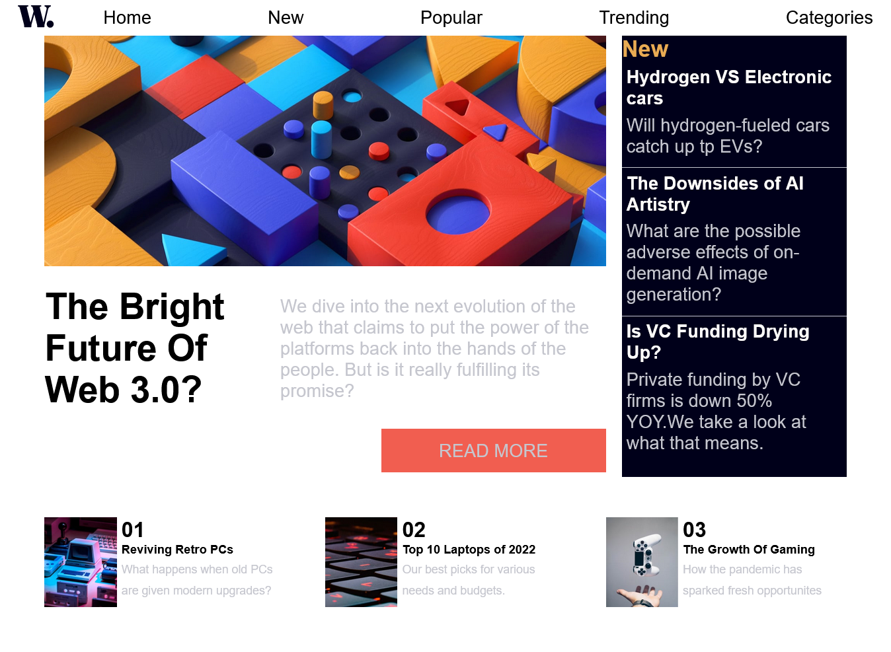
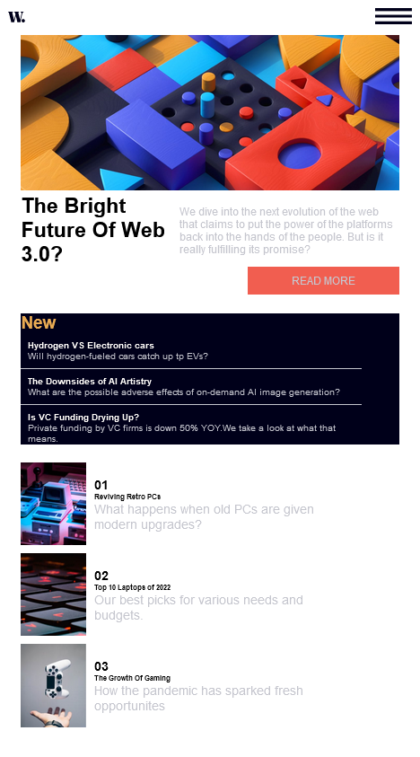
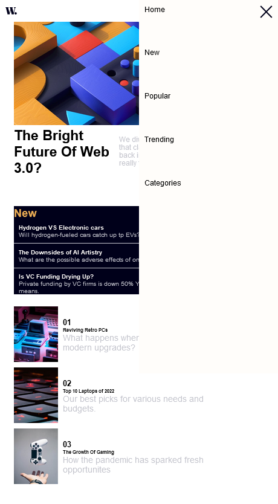

# Frontend Mentor - News homepage

## The challenge

Build out a news website homepage

Users should be able to:
- View the optimal layout for the interface depending on their device's screen size
- See hover and focus states for all interactive elements on the page
- Toggle the mobile menu (requires some JavaScript)

### Screenshot

### Built with
- Semantic HTML5 markup
- CSS custom properties
- Flexbox